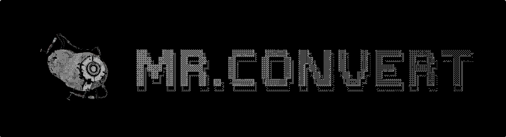

<div align="center">

# Bot de Conversión de Archivos Interactivo
*Tu asistente personal para conversión y edición de archivos en Telegram*


🔧 [Características](#-características-principales) • ⚙️ [Tecnologías](#-tecnologías) • 📦 [Instalación](#-instalación-y-configuración) • 🎯 [Uso](#-cómo-usar-el-bot) • 🏗️ [Arquitectura](#-estructura-del-proyecto)

---

</div>

**Mr.Convert** es un bot de Telegram inteligente y fácil de usar que te permite convertir y editar archivos directamente desde tu chat. ¡Olvídate de aplicaciones pesadas y conversores online lentos!

## 🎯 ¿Qué hace Mr.Convert?

### 🚀 Características Principales

<table>
<tr>
<td width="50%">

#### 🎨 **Edición de Imágenes**
- 🔄 **Conversión de formato** (PNG ↔ JPEG)
- 📏 **Redimensionamiento** inteligente
- ⚡ **Optimización de calidad**
- 🎭 **Filtros artísticos**

</td>
<td width="50%">

#### 📄 **Conversión de Documentos**
- 📄➡️🖼️ **PDF a imágenes** (alta calidad)
- 🖼️➡️📄 **Imágenes a PDF**
- 🗜️ **Compresión de PDF**
- 📦 **Procesamiento por lotes**

</td>
</tr>
</table>

---

## ⚙️ Tecnologías

- **Python 3.11+** - Lenguaje principal
- **python-telegram-bot** - SDK oficial de Telegram
- **PIL/Pillow** - Procesamiento de imágenes
- **pdf2image** - Conversión de PDF
- **Docker** - Containerización
- **Railway** - Despliegue en la nube

---

## 🎮 Cómo Usar el Bot

### 1️⃣ **Inicia una conversación**
```
/start
```

### 2️⃣ **Selecciona tu opción**
Usa los menús interactivos para navegar entre las diferentes funciones.

### 3️⃣ **Envía tu archivo**
Simplemente arrastra y suelta tu imagen o PDF en el chat.

### 4️⃣ **¡Listo!**
Recibe tu archivo convertido al instante.

---

## 🛠️ Instalación y Configuración

### 📋 Requisitos Previos

- Python 3.11+
- Cuenta de Telegram
- Token de Bot (obtén uno de [@BotFather](https://t.me/botfather))

### 🔧 Instalación Local

1. **Clona el repositorio**
   ```bash
   git clone https://github.com/tu-usuario/telegram-bot.git
   cd telegram-bot
   ```

2. **Instala las dependencias**
   ```bash
   pip install -r requirements.txt
   ```

3. **Configura las variables de entorno**
   ```bash
   # Crea un archivo .env
   echo "BOT_TOKEN=tu_token_aqui" > .env
   echo "TEMP_DIR=./temp" >> .env
   ```

4. **Ejecuta el bot**
   ```bash
   python main.py
   ```

### 🐳 Instalación con Docker

```bash
# Construye la imagen
docker build -t mr-convert-bot .

# Ejecuta el contenedor
docker run -d --name mr-convert \
  -e BOT_TOKEN=tu_token_aqui \
  -v $(pwd)/temp:/app/temp \
  mr-convert-bot
```

---

## 📁 Estructura del Proyecto

```
telegram-bot/
├── 🐳 Dockerfile              # Configuración de Docker
├── 🚀 main.py                 # Punto de entrada principal
├── 📦 requirements.txt        # Dependencias de Python
├── 📁 src/
│   ├── 🎮 handlers/           # Manejadores de eventos
│   │   ├── 🖼️ image_conversion/
│   │   │   └── convert_images.py
│   │   ├── 📋 menus/          # Sistema de menús
│   │   │   ├── keyboards.py   # Teclados interactivos
│   │   │   ├── menu_router.py # Enrutador de menús
│   │   │   └── ...
│   │   └── 📄 pdf_conversion/
│   │       └── convert_pdf.py
│   └── 🛠️ utils/             # Herramientas auxiliares
│       └── image_tools.py
└── 📂 temp/                   # Archivos temporales
```

---

<!-- ## 🎨 Capturas de Pantalla

<div align="center">

### 🏠 Menú Principal


### 🎨 Edición de Imágenes


### 📄 Conversión PDF


</div>

--- -->

## ⚙️ Configuración Avanzada

### 🔧 Variables de Entorno

| Variable | Descripción | Valor por Defecto |
|----------|-------------|-------------------|
| `BOT_TOKEN` | Token del bot de Telegram | *(Requerido)* |
| `TEMP_DIR` | Directorio para archivos temporales | `./temp` |

### 🎛️ Personalización

El bot está diseñado para ser fácilmente personalizable:

- **Menús**: Modifica `src/handlers/menus/keyboards.py`
- **Mensajes**: Personaliza los textos en el mismo archivo
- **Funciones**: Añade nuevas conversiones en `src/handlers/`

---

## 🔒 Seguridad y Privacidad

- ✅ **Archivos temporales** se eliminan automáticamente
- ✅ **Sin almacenamiento permanente** de datos del usuario
- ✅ **Procesamiento local** - tus archivos no se envían a terceros
- ✅ **Límite de tamaño** de 20MB por archivo

---

## 📈 Roadmap

### 🎯 Próximas Características

- [ ] 📊 **Conversión de Excel/CSV**
- [ ] 🎵 **Procesamiento de audio**
- [ ] 🎬 **Conversión de video básica**
- [ ] 🌐 **Edición de imagen básica**
- [ ] 📱 **Funcionalidades extra**

---

<div align="center">

### 💜 ¿Te gusta Mr.Convert?

[](../../stargazers)

**¡Dale una estrella ⭐ al repositorio!**

---

*Made with ❤️ and ☕*

</div>
